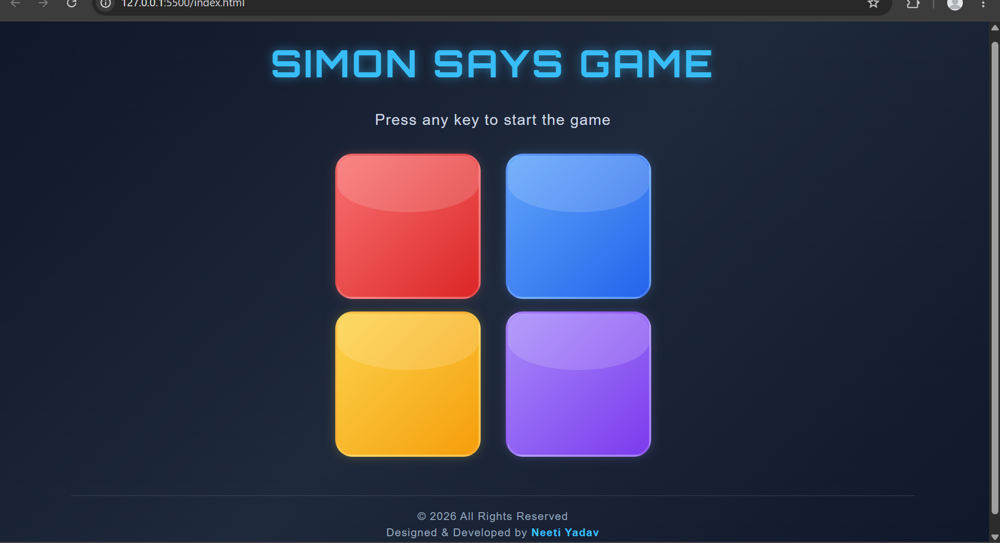

# Simon Says Game

This is a simple Simon Says game built using HTML, CSS, and JavaScript.

The game tests your memory by showing a sequence of colored buttons. Your task is to remember the sequence and click the buttons in the same order. The sequence becomes longer after every level, making the game more challenging.

## Features

* Random color sequence generation
* Level-based gameplay
* Game over detection
* Restart the game by pressing any key
* Simple and responsive user interface

## Technologies Used

* HTML
* CSS
* JavaScript

## How to Play

1. Press any key on your keyboard to start the game.
2. Watch the highlighted button carefully.
3. Use your mouse or touchpad to click the colored buttons in the same order.
4. Complete the sequence to move to the next level.
5. If you click the wrong button, the game is over.
6. Press any key to start a new game.

## Project Structure

```text
Simon-Says-Game/
├── index.html
├── style.css
├── app.js
├── gamess.png
└── README.md
```

## Screenshot



## Author

**Neeti Yadav**
